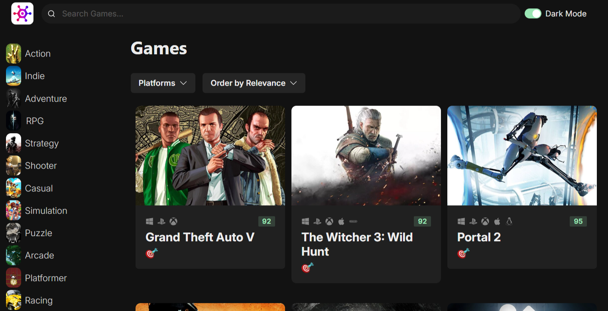

# 🎮 GameDiscovery - Explore Games like never before!

### 👾 Tech stack

##### `Axios`

##### `React`

##### `Chakra UI`

##### `TypeScript`

### 🎯Features

-   Advanced Game Filtering: Effortlessly refine your game selection with powerful filtering options tailored to your preferences.
     
-   Dark Mode Support: Enjoy a seamless transition between light and dark modes for an optimal viewing experience.

## 🚦Running the Project

To run the project in your local environment, follow these steps:

1. Clone the repository to your local machine.
2. Run `npm install` or `yarn` in the project directory to install the required dependencies.
3. Run `npm run start` or `yarn start` to get the project started.
4. Open [http://localhost:5173](http://localhost:5173) (or the address shown in your console) in your web browser to view the app.
